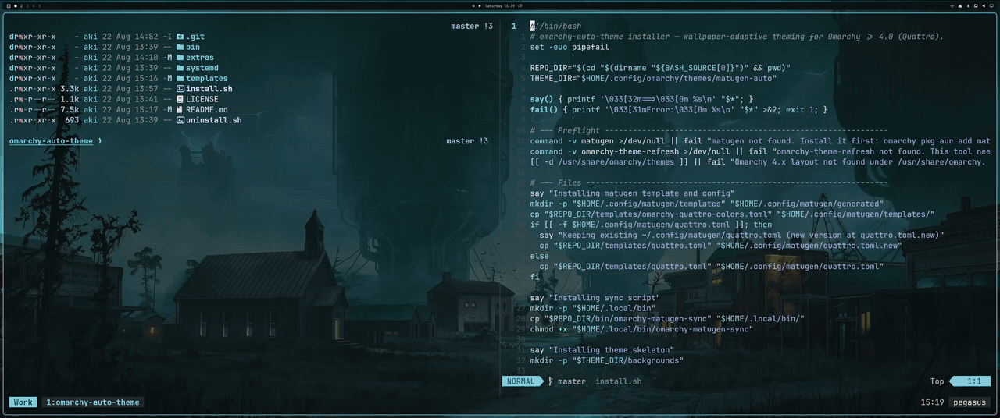

# omarchy-auto-theme

Automatic wallpaper-based theming for [Omarchy](https://omarchy.org) 4.0 (Quattro): dynamic Material You colors for your whole Hyprland desktop, regenerated on every wallpaper change.



Change your wallpaper and the desktop follows, with no extra clicks: [matugen](https://github.com/InioX/matugen) extracts a Material You palette from the image and renders it into a real Omarchy theme. Omarchy then propagates that palette to everything it themes, which on 4.0 means the Quickshell bar, notifications, the lock screen, terminals, neovim, btop, Claude Code, and about fifteen other apps, all from one generated `colors.toml`. If you know pywal or wallust, this is that idea, built natively on Omarchy's own theme engine.

Omarchy 4.0 shipped without dynamic colors (it's an open wish in [basecamp/omarchy#1153](https://github.com/basecamp/omarchy/discussions/1153)). This adds them without touching any packaged file.

## How it works

```
wallpaper change (keybind, bg-switcher, CLI)
        │  systemd path unit watches ~/.local/state/omarchy/current
        ▼
omarchy-matugen-sync
        │  matugen: image → Material You palette → colors.toml
        ▼
~/.config/omarchy/themes/matugen-auto/colors.toml
        │  omarchy theme refresh
        ▼
every app Omarchy themes, live-reloaded
```

Everything is installed under your home directory, so `omarchy update` won't overwrite it.

## Requirements

- Omarchy 4.0+ (Quattro)
- matugen: `omarchy pkg aur add matugen-bin`

## Install

```bash
git clone https://github.com/AccursedGalaxy/omarchy-auto-theme.git
cd omarchy-auto-theme
./install.sh
omarchy theme set matugen-auto
```

Then hit `SUPER + CTRL + SPACE` and pick a wallpaper.

## Using your own wallpapers

The installer seeds a few starter backgrounds. To use your own collection, point Omarchy's user-background directory at it:

```bash
ln -sfn ~/Pictures/Wallpapers ~/.config/omarchy/backgrounds/matugen-auto
omarchy theme set matugen-auto   # re-apply so Omarchy picks up the new list
```

If `~/.config/omarchy/backgrounds/matugen-auto` already exists as a real directory (not a symlink), `ln -sfn` would create the link *inside* it instead of replacing it. Move the directory aside first:

```bash
mv ~/.config/omarchy/backgrounds/matugen-auto ~/.config/omarchy/backgrounds/matugen-auto.bak
ln -s ~/Pictures/Wallpapers ~/.config/omarchy/backgrounds/matugen-auto
```

One quirk: Omarchy snapshots the background list when a theme is applied, so wallpapers you add later only show up in the switcher after the next `omarchy theme set matugen-auto`. Color generation itself always uses whatever wallpaper is currently set.

## Extras

Adaptive tmux status bar (`extras/tmux-colors.conf.template`): a tmux theme driven by the same palette. Copy it to `~/.config/matugen/templates/tmux-colors.conf`, uncomment the `[templates.tmux]` block in `~/.config/matugen/omarchy-auto-theme.toml`, and add this line to your tmux.conf:

```
source-file -q ~/.config/matugen/generated/tmux-colors.conf
```

Terminal transparency fix (`extras/omarchy-theme-set-tmux-transparent`): Omarchy 4 paints a solid theme background onto tmux panes on every theme change (via tmux's `window-style`), which defeats transparent terminals and causes a dark flash on each wallpaper switch. The fix is a PATH shim: a copy of Omarchy's `omarchy-theme-set-tmux` that skips the background painting while keeping the palette sync. Omarchy calls the command by name, so a copy in `~/.local/bin` wins:

```bash
cp extras/omarchy-theme-set-tmux-transparent ~/.local/bin/omarchy-theme-set-tmux
chmod +x ~/.local/bin/omarchy-theme-set-tmux
```

Since this shadows a packaged script, diff it against `/usr/share/omarchy/bin/omarchy-theme-set-tmux` after major Omarchy updates.

One caveat: Omarchy puts its own bin directory first on the session PATH, so theme changes triggered from the shell menu still hit the packaged script. To make the shim win session-wide, re-prepend `~/.local/bin` from your `~/.config/hypr/hyprland.lua`:

```lua
do
  local local_bin = (os.getenv("HOME") or "") .. "/.local/bin"
  local omarchy_bin = (os.getenv("OMARCHY_PATH") or "/usr/share/omarchy") .. "/bin"
  local kept = {}
  for entry in (os.getenv("PATH") or "/usr/local/bin:/usr/bin"):gmatch("[^:]+") do
    if entry ~= local_bin and entry ~= omarchy_bin then table.insert(kept, entry) end
  end
  table.insert(kept, 1, omarchy_bin)
  table.insert(kept, 1, local_bin)
  hl.env("PATH", table.concat(kept, ":"))
end
```

Claude Code needs nothing extra. Omarchy renders a Claude theme from `colors.toml` and hot-reloads running sessions; activate it once with `omarchy-theme-set-claude --activate`.

The same pattern extends to anything matugen can template (neovim, starship, zsh, yazi, and so on): add a `[templates.<name>]` block to `~/.config/matugen/omarchy-auto-theme.toml` with your template and an output path. Every wallpaper change renders all of them from the same palette in one matugen run. The config is yours to extend: once you modify it, the installer and uninstaller leave it alone (upgrades land the distributed version next to it as `omarchy-auto-theme.toml.new`).

Two hard-won rules for those extra templates:

- **Prefer indexed ANSI colors (`38;5;N`, `fg=4`) over hex in anything a shell prints** — prompts, `LS_COLORS`, fzf, zsh syntax highlighting. Hex bakes RGB into every terminal cell forever; indexed cells follow the terminal palette, so a theme change recolors your entire scrollback live, even inside tmux. Roles beyond the ANSI 16 can live in `color16+` via a small generated kitty include. Files built this way are static — they need no reload hook at all.
- **Never use a post_hook that broadcasts signals at shells** (`pkill -USR2 zsh` and friends). Any process that hasn't installed a handler dies — including the zsh parked on `tmux attach` in `.zshrc`, which takes its tmux client and the whole terminal window down with it. If an app must be told to reload, have it watch its generated file instead (nvim: `vim.uv.new_fs_poll`).

## Tuning

After install, the palette mapping lives in `~/.config/matugen/templates/omarchy-quattro-colors.toml`. Two things to know before editing it:

- matugen 4.x's `set_lightness` filter is absolute: it sets the HSL lightness percentage while keeping hue and saturation, and negative values clamp to black. The template relies on this for the background ramp and the bright colors.
- Non-interactive matugen 4.x errors out with "Multiple source colors found" unless you pass `--prefer`. The sync script uses `--prefer saturation`; swap it for `darkness`, `lightness`, or another preference in `~/.local/bin/omarchy-matugen-sync` if you want a different vibe.

For light mode, change `--mode dark` to `--mode light` in the sync script and `mode = "dark"` to `mode = "light"` in the template.

## Troubleshooting

Start with the built-in diagnosis, which checks every link in the pipeline (commands, config, template, output dir, wallpaper state, watcher unit):

```bash
~/.local/bin/omarchy-matugen-sync --diagnose
```

If something is off, the usual suspects:

```bash
systemctl --user status omarchy-matugen.path      # is the watcher running?
journalctl --user -u omarchy-matugen.service      # what happened on the last trigger?
~/.local/bin/omarchy-matugen-sync                 # run the sync by hand
```

The sync script deliberately exits silently when the `matugen-auto` theme isn't the active one, when no wallpaper is set, or when the wallpaper hasn't changed since the last run (it fingerprints path + size + mtime). If colors aren't updating, `--diagnose` will tell you which of those guards is the reason.

## How is this different from tema or pywal?

[tema](https://github.com/bjarneo/tema) is a theme *generator* app: you open it, pick a wallpaper, pick dark or light, and apply. It's a nice tool, and if you want a one-shot generated theme it may be all you need. omarchy-auto-theme is a *pipeline*: after install there is nothing to open. The systemd path unit notices every wallpaper change (keybind, bg-switcher, CLI) and regenerates the theme in the background.

[pywal](https://github.com/dylanaraps/pywal) and [wallust](https://codeberg.org/explosion-mental/wallust) solve wallpaper-based colors generically, but you have to wire every application yourself. This project instead feeds Omarchy's own theme engine, so all the app integrations Omarchy already ships (and maintains through updates) come for free. It also uses Material You color science via matugen rather than raw dominant-color extraction, which tends to produce palettes that are usable as UI colors rather than just pretty.

## Uninstall

```bash
./uninstall.sh
omarchy theme set tokyo-night   # or any theme you like
```

The uninstaller only removes files this project installed. The theme directory (`~/.config/omarchy/themes/matugen-auto`) is left in place so you keep your backgrounds, and any config or template you modified is kept too (it tells you which). Delete those yourself if you want a full cleanup.

## License

MIT
